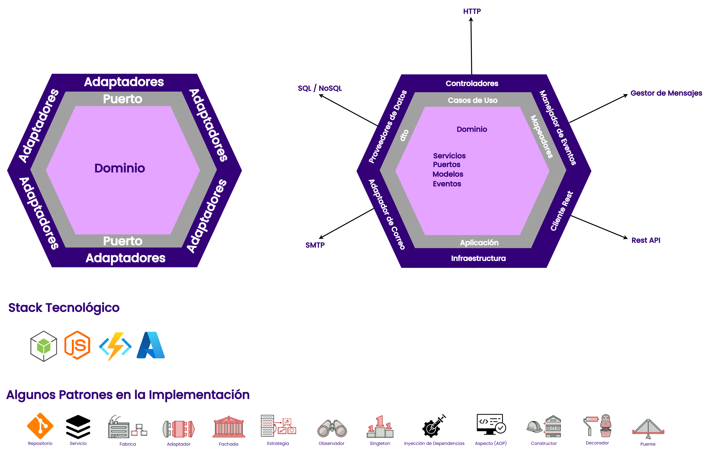
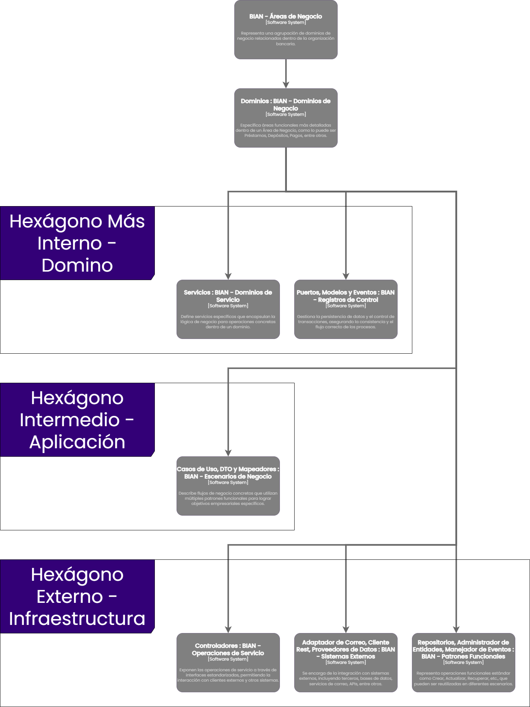
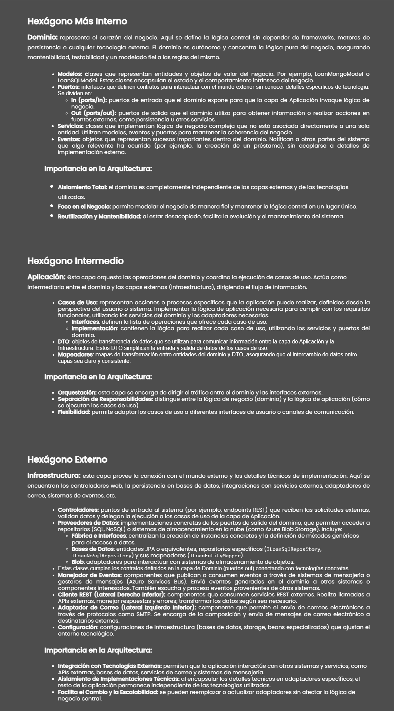

| Fecha | Descripción | Realizado por | Validado por | Fecha de Validación |
|:-:|:-:|:-:|:-:|:-:|
| 23/01/2025 | Creación del Documento | José Gabriel Chica Rojas|**|**|

# Arquetipo

## 1. Arquitectura Hexagonal

La Arquitectura Hexagonal (también conocida como Arquitectura de Puertos y Adaptadores) es un patrón arquitectónico que promueve la separación de preocupaciones al dividir la aplicación en capas o componentes independientes. El núcleo de la aplicación (dominio) está aislado de los detalles de infraestructura y tecnología, permitiendo que los componentes externos interactúen con el núcleo a través de puertos (interfaces) y adaptadores (implementaciones concretas).

* **Aplicación en el Arquetipo:**
    * **Dominio (domain):** contiene la lógica de negocio pura, incluyendo entidades, servicios de dominio y repositorios (interfaces).
    * **Aplicación (application):** orquesta los casos de uso y actúa como intermediario entre el dominio y el mundo exterior.
    * **Infraestructura (infrastructure):** implementa los detalles técnicos y de infraestructura, como controladores, repositorios concretos, adaptadores y configuraciones.



## 2. Estructura del Proyecto

```scss
    📦src
    ┣ 📂functions
    ┃ ┗ 📜ObtainParameterFunction.ts
    ┣ 📂mercantil
    ┃ ┗ 📂arquetipo
    ┃ ┃ ┣ 📂crosscutting
    ┃ ┃ ┃ ┣ 📂configuration
    ┃ ┃ ┃ ┃ ┣ 📂extended
    ┃ ┃ ┃ ┃ ┗ 📜AppConfig.ts
    ┃ ┃ ┃ ┣ 📂dto
    ┃ ┃ ┃ ┃ ┣ 📂request
    ┃ ┃ ┃ ┃ ┃ ┣ 📂extended
    ┃ ┃ ┃ ┃ ┃ ┗ 📜PaginationRequestDto.ts
    ┃ ┃ ┃ ┃ ┗ 📂response
    ┃ ┃ ┃ ┃ ┃ ┣ 📜ApiResponse.ts
    ┃ ┃ ┃ ┃ ┃ ┣ 📜ErrorResponse.ts
    ┃ ┃ ┃ ┃ ┃ ┗ 📜PaginationResponseDto.ts
    ┃ ┃ ┃ ┣ 📂helpers
    ┃ ┃ ┃ ┃ ┗ 📜handleFunctionErrors.ts
    ┃ ┃ ┃ ┣ 📂http
    ┃ ┃ ┃ ┃ ┣ 📜AxiosHttpClient.ts
    ┃ ┃ ┃ ┃ ┣ 📜HttpClient.ts
    ┃ ┃ ┃ ┃ ┗ 📜index.ts
    ┃ ┃ ┃ ┣ 📂logging
    ┃ ┃ ┃ ┃ ┗ 📜Logger.ts
    ┃ ┃ ┃ ┣ 📂middleware
    ┃ ┃ ┃ ┃ ┣ 📜ErrorHandlingMiddleware.ts
    ┃ ┃ ┃ ┃ ┗ 📜validationMiddleware.ts
    ┃ ┃ ┃ ┗ 📂utils
    ┃ ┃ ┃ ┃ ┣ 📜Constants.ts
    ┃ ┃ ┃ ┃ ┗ 📜ResponseUtils.ts
    ┃ ┃ ┣ 📂parameterManagement
    ┃ ┃ ┃ ┣ 📂application
    ┃ ┃ ┃ ┃ ┣ 📂dto
    ┃ ┃ ┃ ┃ ┃ ┗ 📂response
    ┃ ┃ ┃ ┃ ┃ ┃ ┗ 📜Parameter.ts
    ┃ ┃ ┃ ┃ ┗ 📂useCases
    ┃ ┃ ┃ ┃ ┃ ┗ 📜GetParameterUseCase.ts
    ┃ ┃ ┃ ┣ 📂domain
    ┃ ┃ ┃ ┃ ┣ 📂ports
    ┃ ┃ ┃ ┃ ┃ ┗ 📜IParameterRepository.ts
    ┃ ┃ ┃ ┃ ┗ 📂services
    ┃ ┃ ┃ ┃ ┃ ┗ 📜ParameterService.ts
    ┃ ┃ ┃ ┗ 📂infrastructure
    ┃ ┃ ┃ ┃ ┣ 📂controllers
    ┃ ┃ ┃ ┃ ┃ ┗ 📜ParameterController.ts
    ┃ ┃ ┃ ┃ ┗ 📂dataProviders
    ┃ ┃ ┃ ┃ ┃ ┗ 📂userData
    ┃ ┃ ┃ ┃ ┃ ┃ ┗ 📜RedisParameterRepository.ts
    ┃ ┃ ┗ 📂userManagement
    ┃ ┃ ┃ ┣ 📂application
    ┃ ┃ ┃ ┃ ┣ 📂dto
    ┃ ┃ ┃ ┃ ┃ ┣ 📂request
    ┃ ┃ ┃ ┃ ┃ ┃ ┣ 📜CreateUserDto.ts
    ┃ ┃ ┃ ┃ ┃ ┃ ┗ 📜UpdateUserDto.ts
    ┃ ┃ ┃ ┃ ┃ ┗ 📂response
    ┃ ┃ ┃ ┃ ┃ ┃ ┗ 📜UserDtoResponse.ts
    ┃ ┃ ┃ ┃ ┣ 📂mappers
    ┃ ┃ ┃ ┃ ┃ ┗ 📜UserMapper.ts
    ┃ ┃ ┃ ┃ ┗ 📂useCases
    ┃ ┃ ┃ ┃ ┃ ┣ 📜CreateUserUseCase.ts
    ┃ ┃ ┃ ┃ ┃ ┣ 📜DeleteUserUseCase.ts
    ┃ ┃ ┃ ┃ ┃ ┣ 📜GetAllUsersUseCase.ts
    ┃ ┃ ┃ ┃ ┃ ┣ 📜GetUserUseCase.ts
    ┃ ┃ ┃ ┃ ┃ ┗ 📜UpdateUserUseCase.ts
    ┃ ┃ ┃ ┣ 📂domain
    ┃ ┃ ┃ ┃ ┣ 📂models
    ┃ ┃ ┃ ┃ ┃ ┗ 📜User.ts
    ┃ ┃ ┃ ┃ ┣ 📂ports
    ┃ ┃ ┃ ┃ ┃ ┣ 📂in
    ┃ ┃ ┃ ┃ ┃ ┃ ┗ 📜UserRepositoryPort.ts
    ┃ ┃ ┃ ┃ ┃ ┗ 📂out
    ┃ ┃ ┃ ┃ ┃ ┃ ┗ 📜ParameterRepositoryPort.ts
    ┃ ┃ ┃ ┃ ┗ 📂services
    ┃ ┃ ┃ ┃ ┃ ┗ 📜UserService.ts
    ┃ ┃ ┃ ┗ 📂infrastructure
    ┃ ┃ ┃ ┃ ┣ 📂controllers
    ┃ ┃ ┃ ┃ ┃ ┗ 📜UserController.ts
    ┃ ┃ ┃ ┃ ┗ 📂dataProviders
    ┃ ┃ ┃ ┃ ┃ ┣ 📂restClients
    ┃ ┃ ┃ ┃ ┃ ┃ ┣ 📂implementation
    ┃ ┃ ┃ ┃ ┃ ┃ ┃ ┗ 📜ParameterRestClient.ts
    ┃ ┃ ┃ ┃ ┃ ┃ ┗ 📂response
    ┃ ┃ ┃ ┃ ┃ ┃ ┃ ┗ 📜ParameterResponseDTO.ts
    ┃ ┃ ┃ ┃ ┃ ┗ 📂userData
    ┃ ┃ ┃ ┃ ┃ ┃ ┗ 📜userDataProvider.ts
    ┣ 📂openapi
    ┃ ┣ 📂parameters
    ┃ ┃ ┗ 📜keyParameter.yaml
    ┃ ┣ 📂resources
    ┃ ┃ ┣ 📜parameters.yaml
    ┃ ┃ ┗ 📜users.yaml
    ┃ ┣ 📂responses
    ┃ ┃ ┣ 📜errorResponse.yaml
    ┃ ┃ ┣ 📜parameterSuccessResponse.yaml
    ┃ ┃ ┗ 📜userSuccessResponse.yaml
    ┃ ┣ 📂schemas
    ┃ ┃ ┣ 📜createUser.yaml
    ┃ ┃ ┣ 📜parameterResponse.yaml
    ┃ ┃ ┗ 📜userResponse.yaml
    ┃ ┣ 📜index.bundled.yaml
    ┃ ┗ 📜index.yaml
    ┣ 📜index.ts
    ┗ 📜indexRestApplication.ts
```

## 3. Homologación Arquitectura Hexagonal a BIAN



## 4. Patrones de Diseño Implementados

### 4.1. Patrón Repositorio (Repository Pattern)

El Patrón Repositorio abstrae el acceso a los datos, permitiendo a la aplicación interactuar con las fuentes de datos de una manera consistente e independiente de la implementación concreta (base de datos SQL, Redis).

* **Aplicación en el Arquetipo:**
    * **Interfaces de Repositorio en el Dominio:**
        **`IParameterRepository.ts`**
        **`UserRepositoryPort.ts`**

    * **Implementaciones en Infraestructura:**
        **`userDataProvider.ts`** implementación genérica para repositorios.
        **`RedisParameterRepository.ts`**  implementaciones específicas para Redis.

* **Cómo se Aplica:**
    * Los servicios de dominio utilizan las interfaces de repositorio para acceder a los datos, sin conocer los detalles de cómo se almacenan o recuperan.
    * Las implementaciones concretas de los repositorios se ubican en la capa de infraestructura, permitiendo cambiar o agregar nuevas fuentes de datos sin afectar al dominio.

### 4.2. Patrón Servicio (Service Layer Pattern)

El Patrón Servicio define una capa de servicios que encapsula la lógica de negocio y coordina las operaciones de los repositorios y otras entidades del dominio.

* **Aplicación en el Arquetipo:**
    * **Servicios de Dominio:**
        **`ParameterService.ts`** en **`mercantil/arquetipo/parameterManagement/domain/services`**

    * **Casos de Uso en la Capa de Aplicación:**
        **`GetParameterUseCase.ts`**

* **Cómo se Aplica:**
    * Los casos de uso (**`usecases`**) utilizan los servicios de dominio para ejecutar operaciones de negocio específicas.
    * Los servicios de dominio encapsulan la lógica de negocio, manteniendo el dominio coherente y evitando que los controladores o casos de uso tengan lógica de negocio.

### 4.3. Patrón de Fábrica (Factory Pattern)

El Patrón de Fábrica proporciona una forma de crear objetos sin exponer la lógica de creación al cliente, y se utiliza para encapsular la creación de objetos.

* **Aplicación en el Arquetipo:**
    * **Clase **`AppConfig.ts`** en **`crosscutting/configuration`**:**
        * Es responsable de actuar como una fábrica para crear y configurar instancias reutilizables, como clientes HTTP, servicios o repositorios..

* **Cómo se Aplica:**
    * La fábrica decide qué implementación de **`DataProviders`** o **`Repository`** utilizar en tiempo de ejecución, ocultando los detalles de creación al resto de la aplicación.
    * Facilita la inyección de dependencias y el cambio de implementaciones sin modificar el código cliente.

### 4.4. Patrón Adaptador (Adapter Pattern)

El Patrón Adaptador permite que clases con interfaces incompatibles trabajen juntas, convirtiendo la interfaz de una clase en otra que el cliente espera.

* **Aplicación en el Arquetipo:**
    * **Adaptadores en **`infrastructure/dataproviders`** y el `crosscutting/http`:**
        * Proveedores de Datos:
            **`RedisParameterRepository.ts`** implementa **`IParameterRepository`**
            **`userDataProvider.ts`** implementa **`UserRepositoryPort`**
            **`AxiosHttpClient.ts`** implementa **`HttpClient`**
        *

* **Cómo se Aplica:**
    * Los adaptadores implementan las interfaces esperadas por el dominio o la aplicación y traducen las llamadas a las implementaciones concretas.
    * Permiten que el dominio y la aplicación no dependan de detalles específicos de infraestructura o servicios externos.

### 4.5. Patrón Fachada (Facade Pattern)

El Patrón Fachada proporciona una interfaz simplificada a un conjunto de interfaces en un subsistema, haciendo que el subsistema sea más fácil de usar.

* **Aplicación en el Arquetipo:**
    * **Servicios de Dominio como Fachadas:**
        * **`ParameterService.ts`** actúa como una fachada que encapsula las operaciones relacionadas con parámetros, proporcionando métodos sencillos al resto de la aplicación.

* **Cómo se Aplica:**
    * Los servicios de dominio ofrecen una interfaz clara y simplificada para operaciones complejas que pueden involucrar múltiples repositorios, entidades y lógica de negocio.
    * Facilitan la interacción con el dominio desde los casos de uso y controladores.

### 4.6. Patrón Estrategia (Strategy Pattern)

El Patrón Estrategia permite definir una familia de algoritmos, encapsular cada uno y hacerlos intercambiables. Permite que el algoritmo varíe independientemente de los clientes que lo utilizan.

* **Aplicación en el Arquetipo:**
    * **Múltiples Implementaciones de Proveedores de Datos:**
        * Interfaces como **`UserRepositoryPort`**y sus implementaciones correspondientes (**`userDataProvider.ts`**).

* **Cómo se Aplica:**
    * La aplicación puede elegir dinámicamente qué estrategia (proveedor de datos) utilizar en tiempo de ejecución, permitiendo cambiar entre diferentes formas de acceso a datos sin modificar el código cliente.
    * Facilita la extensión de nuevas estrategias de almacenamiento o acceso a datos en el futuro.


### 4.7. Patrón Singleton

El Patrón Singleton asegura que una clase tenga solo una instancia y proporciona un punto de acceso global a ella.

* **Aplicación en el Arquetipo:**
    * **Servicios de Configuración y Manejo de Secretos:**
        * **`AppConfig.ts`**, **`Logger.ts`** esta implementado como un singleton para asegurar un único punto de acceso a los secretos de la aplicación.

* **Cómo se Aplica:**
    * Garantiza que componentes críticos como la configuración de secretos o ciertos servicios compartidos tengan una única instancia en toda la aplicación.
    * Controla el acceso y gestión de recursos compartidos.

### 4.8. Patrón Inyección de Dependencias (Dependency Injection)

La Inyección de Dependencias es un patrón donde las dependencias (servicios, repositorios, etc.) son proporcionadas a una clase en lugar de ser creadas por ella misma. Promueve la modularidad y facilita las pruebas.

* **Aplicación en el Arquetipo:**
    * **Uso de Anotaciones como **`@Autowired:`****
        * Inyección de servicios y repositorios en controladores y casos de uso.
    * **Configuraciones en **`infrastructure/controller`**:**
        * Clases como **`UserController.ts`** y **`ParameterController.ts`** definen cómo se configuran e inyectan las dependencias.

* **Cómo se Aplica:**
    * Las clases no crean sus propias dependencias, sino que las reciben a través del constructor o propiedades, facilitando la inversión de control.
    * Mejora la testeabilidad al permitir inyectar implementaciones simuladas o mock durante las pruebas.

### 4.9. Patrón Aspecto (Aspect-Oriented Programming - AOP)

La Programación Orientada a Aspectos permite separar las preocupaciones transversales (como logging, manejo de excepciones, seguridad, entre otros) del código de negocio principal mediante la definición de aspectos.

* **Aplicación en el Arquetipo:**
    * **Aspects en **`crosscutting/helpers`**:**
        * **`handleFunctionErrors.ts`**

* **Cómo se Aplica:**
    * Los aspectos interceptan llamadas a métodos y añaden funcionalidad adicional sin modificar el código original.
    * Facilitan la implementación de funcionalidades transversales de manera centralizada y reutilizable.

### 4.10. Patrón Builder (Constructor)

El Patrón Builder separa la construcción de un objeto complejo de su representación, permitiendo que el mismo proceso de construcción pueda crear diferentes representaciones.

* **Aplicación en el Arquetipo:**
    * **Construcción de Objetos DTO o Entidades:**
        * Se esta utilizando builders para crear instancias de **`PaginationRequestDto.ts`** o **`Parameter.ts`** con un enfoque más legible y mantenible.

* **Cómo se Aplica:**
    * Facilita la creación de objetos con múltiples propiedades, especialmente cuando algunas son opcionales o requieren validación.
    * Mejora la legibilidad y evita constructores con muchos parámetros.

### 4.11. Patrón Decorador (Decorator Pattern)

El Patrón Decorador permite agregar dinámicamente responsabilidades adicionales a un objeto.

* **Aplicación en el Arquetipo:**
    * **Servicios de Mensajes y Logging:**
        * Se esta decorando servicios para añadir funcionalidades adicionales como **`ErrorHandlingMiddleware.ts`** o **`validationMiddleware.ts`**.

* **Cómo se Aplica:**
    * Extiende la funcionalidad de los servicios sin modificar su código original.
    * Permite agregar características de manera flexible y modular.

### 4.12. Patrón Puente (Bridge Pattern)

El Patrón Puente desacopla una abstracción de su implementación para que ambas puedan variar independientemente.

* **Aplicación en el Arquetipo:**
    * **Interfaces y Implementaciones Separadas:**
        * Separación de interfaces como **`IParameterRepository.ts`** y sus implementaciones en **`RedisParameterRepository.ts`**.
        * Esto permite cambiar la implementación del repositorio sin afectar quien lo utiliza.

* **Cómo se Aplica:**
    * Permite que la abstracción y la implementación evolucionen de manera independiente.
    * Facilita la extensión y modificación de implementaciones sin cambiar las abstracciones.

### 4.13. Aplicación de los Principios SOLID

Además de los patrones de diseño, se esta aplicando los principios **`SOLID`**:

* **Single Responsibility Principle (SRP):**
    * Cada clase tiene una responsabilidad clara, como **`ParameterService`** para lógica de negocio o **`ParameterController`** para manejar solicitudes HTTP.

* **Open/Closed Principle (OCP):**
    * Las interfaces en domain/ports permiten que el sistema sea extensible sin modificar las clases existentes.

* **Liskov Substitution Principle (LSP):**
    * Las implementaciones de repositorios (**`RedisParameterRepository`**) pueden reemplazar sus interfaces (**`IParameterRepository`**) sin alterar el comportamiento del sistema.

* **Interface Segregation Principle (ISP):**
    * Las interfaces están bien definidas y especializadas, como **`IParameterRepository`** y **`UserRepositoryPort`**.

* **Dependency Inversion Principle (DIP):**
    * Los casos de uso (**`GetParameterUseCase`**, **`CreateUserUseCase`**) dependen de abstracciones como servicios y repositorios, no de implementaciones concretas.

## 5. Guía de Arquitectura Hexagonal para Desarrolladores

Esta guía proporciona una descripción detallada de la Arquitectura Hexagonal implementada en el arquetipo. Su objetivo es ayudar a los desarrolladores a familiarizarse con las diferentes capas y componentes, explicando su función y cómo interactúan entre sí. Se incluyen referencias a clases y archivos específicos para facilitar la comprensión y navegación del código.




5.1.1. Capa de Dominio

**Propósito:** contiene la lógica de negocio pura y las reglas que gobiernan el comportamiento de la aplicación. Esta capa es independiente de frameworks y detalles de implementación externos. Aquí se modelan las entidades de negocio (ahora llamadas **modelos**), eventos y puertos que permiten una interacción desacoplada con la infraestructura.

**Ubicación:**  **`src\mercantil\arquetipo\userManagement\domain`**

**Componentes Principales:**
* **Modelos (**`models`**):**
 * **`User.ts`**
        * Representan el modelo de negocio **`user`** con sus propiedades y comportamientos.
        * Se definen atributos como el ID del usuario, nombre, apellido y fecha de nacimiento
        * **Ejemplo de Implementación en el Arquetipo:**

            ```typescript
                import { Entity, PrimaryGeneratedColumn, Column } from 'typeorm';

                @Entity({ name: 'users' })
                export class User {
                @PrimaryGeneratedColumn()
                id!: number;

                @Column({ name: 'first_name', type: 'varchar', length: 100 })
                firstName!: string;

                @Column({ name: 'last_name', type: 'varchar', length: 100 })
                lastName!: string;

                @Column({ name: 'birth_date', type: 'date'})
                birthDate!: string;

                constructor(id:number, firstName: string, lastName: string, birthDate: string) {
                    this.id = id;
                    this.firstName = firstName;
                    this.lastName = lastName;
                    this.birthDate = birthDate;
                }
                }

            ```
            
        * **Ejemplo de Uso:**
            ```typescript
                new User(userId, userDto.firstName, userDto.lastName, userDto.bithDate), 
            ```

* **Puertos del Dominio (**`ports`**):**
    * **`in`:** interfaces que definen las operaciones de entrada al dominio; ejemplo: **`UserRepositoryPort.ts`**, **`ParameterRepositoryPort.ts`**.
        * **Ejemplo de Implementación en el Arquetipo:**            

            ```typescript
                import { ApiResponse } from "@crosscutting/dto/response/ApiResponse";
                import { ParameterResponseDTO } from "@userManagement/infrastructure/dataProviders/restClients/response/ParameterResponseDTO";

                export interface ParameterRepositoryPort {
                    getParameter(key: string): Promise<ApiResponse<ParameterResponseDTO>>;
                }
            ```        
        * **Ejemplo de Uso:**
            ```typescript
                export class ParameterRestClient implements ParameterRepositoryPort { ...
                       private readonly httpClient: HttpClient;

                    constructor(httpClient: HttpClient) {
                    this.httpClient = httpClient;
                    }
                
                    async getParameter(key: string): Promise<ApiResponse<ParameterResponseDTO>> {
                    const response = await this.httpClient.request<any>({
                        url: `/parameters/${key}`,
                        method: 'GET',
                    });
                
                    return response.data || null;
                    }
                }
            ```          
* **Servicios de Dominio (**`services`**):**
    * **`UserService.ts`**
        * Encapsulan la lógica de negocio relacionada.
        * **Principales Métodos:**
            * **`  async createUser(user: User)`**
            * **Ejemplo de Implementación en el Arquetipo:**
        ```typescript
            export class CreateUserUseCase {
                private readonly userService: UserService;

                constructor(userService: UserService) {
                    this.userService = userService;
                }
                async execute(userDto: CreateUserDto): Promise<User> {
                    const user = new User(0, userDto.firstName, userDto.lastName, userDto.birthDate); 
                    return await this.userService.createUser(user);
                }
            }
        ```
              

#### 5.1.2. Capa de Aplicación

**Propósito:** orquesta los casos de uso de la aplicación, coordinando la interacción entre la capa de dominio y el mundo exterior. No contiene lógica de negocio, sino que se encarga de los flujos y procesos. Esta capa recibe las peticiones de la infraestructura (por ejemplo, a través de controladores), las valida, invoca la capa de dominio y devuelve resultados adecuados.

**Ubicación:** **`src\mercantil\arquetipo\userManagement\application`**

**Componentes Principales:**
* **Casos de Uso (**`usecases`**):**
    * **`CreateUserUseCase.ts`**
        * clases que definen las operaciones de entrada a los casos de uso.
        * **Método Principal:**
            * **`execute(userDto: CreateUserDto)`**
            * **Ejemplo de Implementación en el Arquetipo:**
        ```javascript
            async execute(userDto: CreateUserDto): Promise<User>
        ```    


* **Data Transfer Objects (**`dto`**):**
    * **`CreateUserDto.ts`**
        * Objeto utilizado para transferir datos de usuario entre capas.
        * **Ejemplo de Implementación en el Arquetipo:**
            ```typescript
            {
                import { Constants } from '@crosscutting/utils/Constants';
                import { IsString, IsNotEmpty, Length, IsDateString } from 'class-validator';

                export class CreateUserDto {
                @IsString()
                @IsNotEmpty({ message: Constants.VALIDATION_USERNAME })
                @Length(1, 100, { message: Constants.VALIDATION_USERNAME_LENGTH })
                firstName!: string;

                @IsString()
                @IsNotEmpty({ message: Constants.VALIDATION_LASTNAME })
                @Length(1, 100, { message: Constants.VALIDATION_LASTNAME_LENGTH })
                lastName!: string;

                @IsString()
                @IsNotEmpty({ message: Constants.VALIDATION_BIRTHDATE })
                @IsDateString({}, { message: Constants.VALIDATION_BIRTHDATE_FORMAT })
                birthDate!: string;
                }
            }

            ``` 
* **Mappers (**`mappers`**):**
    * **`UserMapper.ts`**
        * Garantiza que la aplicación tenga un punto centralizado para la conversión de datos.
            * **Ejemplo de Implementación en el Arquetipo:**
                ```typescript
                    export class UserMapper {
                    
                    /**
                    *
                    *
                    * @static
                    * @param {User} user
                    * @return {*}  {UserDtoResponse}
                    * @memberof UserMapper
                    */
                    static toDto(user: User): UserDtoResponse {
                        return new UserDtoResponse(user.id, `${user.firstName} ${user.lastName}`, user.birthDate);
                    }

                    
                    /**
                    *
                    *
                    * @static
                    * @param {UserDtoResponse} UserDtoResponse
                    * @return {*}  {User}
                    * @memberof UserMapper
                    */
                    static toEntity(userDto: UserDtoResponse): User {
                        const [firstName, lastName] = userDto.fullName.split(' ');
                        return new User(userDto.id, firstName, lastName, userDto.birthDate);
                    }
                    }

                ```

#### 5.1.3 Capa de Infraestructura


**Propósito:** implementa los detalles técnicos y proporciona las herramientas necesarias para que la aplicación funcione. Esto incluye controladores, proveedores de datos, clientes REST, entre otros. La infraestructura cumple con los contratos definidos por el dominio (puertos out) proveyendo implementaciones concretas.

**Ubicación:** **`src\mercantil\arquetipo\userManagement\infrastructure`**

**Componentes Principales:**
* **Controladores (**`controllers`**):**
    * **`UserController.ts`**
        * Exponen los endpoints REST para interactuar con la aplicación.
        * Endpoints Principales:
            * **`POST /api/users`** - Crear un nuevo préstamo.
            * **Ejemplo de Implementación en el Arquetipo:**
        ```typescript
        UserController.post(
            '/users',
            validateInput(CreateUserDto),
            async (req: Request, res: Response) => {
                const createUserDto = plainToInstance(CreateUserDto, req.body);
                await handleErrors(
                async () => {
                    const response = await createUserUseCase.execute(createUserDto);
                    const createdUserDto = UserMapper.toDto(response);
                    return new ApiResponse(createdUserDto, Constants.CREATED, 201);       
                },
                res
                );
            }
            );
        ```
* **Proveedores de Datos (**`dataproviders`**):**
    * **`userDataProvider.java`**  
        * **Ejemplo de Implementación en el Arquetipo:**
            ```typescript
                export class UserDataProvider implements UserRepositoryPort {
                private userRepository: Repository<User>;

                constructor() {
                    this.userRepository = AppDataSource.getRepository(User);
                }

                /**
                * Retorna el número total de usuarios.
                */
                async count(): Promise<number> {
                    return await this.userRepository.count();
                }

                /**
                * Busca un usuario por ID.
                * @param userId ID del usuario
                */
                async findById(userId: number): Promise<User | null> {
                    return await this.userRepository.findOneBy({ id: userId });
                }
            ```

* **Cliente Rest (**`restclients`**):**
    * Proveen funcionalidades para consumir sistemas externos.
        > **Nota:** para más detalle visitar en el arquetipo la implementación de esta clase en la siguiente ruta: **`src\mercantil\arquetipo\userManagement\infrastructure\dataProviders\restClients`**

#### 5.1.4. Capas Transversales (Crosscutting)

**Propósito:** contienen funcionalidades que son transversales a todas las capas, como manejo de excepciones, logging, internacionalización de mensajes,configuración global, constantes, http, utilitatios, entre otros. Esta capa ofrece servicios compartidos que no pertenecen a la lógica de negocio ni a la infraestructura específica.

**Ubicación:** **`src\mercantil\arquetipo\crosscutting`**
**Componentes Principales:**
* **configutarion (**`AppConfig`**):**
    * Manejan configuraciones de conexiones globales, ya sea base de datos o conexiones a Redis, entre otros, permite tener generalizadas estas funcionalidades y extenderlos a las capas que se requieran
      * **`AppConfig.ts`**
        * **Ejemplo de Implementación en el Arquetipo:**
            ```typescript
            {
                export const createRedisClient = (): Redis => {
                return new Redis({
                    host: process.env.REDIS_HOST || '127.0.0.1',
                    port: parseInt(process.env.REDIS_PORT || '6379', 10),
                    password: process.env.REDIS_PASSWORD || undefined,
                });
                };
            }
            ```
* **Dtos (**`dto`**):**
    * Gestionan objetos de datos globales que pueden ser utilizados en cada dominio de negocio.
* **Helpers (**`helpers`**):**
    * Manejan funciones globales reutilizables por las funciones serverless.
* **Http (**`http`**):**
    * Centraliza las funciones necesarias para realizar solicitudes HTTP en una única función general.
* **Logging (**`logging`**):**
    * Proporciona una capa de encapsulación para los registros de la aplicación.
* **Middleware (**`middleware`**):**
    * Contiene métodos para la validación de datos de entrada y salida, los cuales deben ser llamados durante la ejecución de las solicitudes.
* **Utils (**`utls`**):**
    * Incluye métodos utilitarios que son utilizados en toda la aplicación, tales como constantes.

#### 5.1.5. Capas Serveless (Functions)

**Propósito:** Contienen las funciones que se ejecutarán como serverless en Azure. Estas funciones serán responsables de invocar los dominios de negocio definidos en el snapshot, o la función específica del dominio que encapsule su respectivo modelo de negocio.
**Ubicación:** **`src\functions`**
      * **`ObtainParameterFunction.ts`**
        * **Ejemplo de Implementación en el Arquetipo:**

        ```typescript

                // Nombre dinámico de la función
                const functionName = `NOVA-${process.env.VALIDATION_TYPE}-${process.env.FUNCTION_NAME_OBTAIN_PARAMETER}-${process.env.ENVIRONMENT}-${process.env.REGION}`;

                async function handler(
                req: HttpRequest,
                context: InvocationContext
                ): Promise<HttpResponseInit> {
                context.log(`Executing Azure Function: ${functionName}`);

                return handleFunctionErrors(context, async () => {
                    const transactionId = req.headers.get('transactionId');
                    const redisClient = createRedisClient();
                    const key = req.params.key;

                    if (!key) {
                    return {
                        status: 400,
                        body: JSON.stringify(new ErrorResponse(Constants.NOT_FOUND, 400)),
                    };
                    }

                    const repository = new RedisParameterRepository(redisClient);
                    const service = new ParameterService(repository);
                    const getParameterUseCase = new GetParameterUseCase(service);

                    const parameterValue = await getParameterUseCase.execute(key);
                    context.log(parameterValue, transactionId);

                    return {
                    status: 200,
                    body: JSON.stringify(new ApiResponse(parameterValue, Constants.DATA_FOUND, 200)),
                    };
                });
                }

                app.http(functionName, {
                methods: ['GET'],
                authLevel: 'function',
                route: 'parameters/{key}',
                handler: handler,
                });

        ```
    

## 6 Guía de configuración y pruebas
Para correr de forma local las funciones declaradas se debe tener lo siguiente.
**Instalar Azure Functions Core Tools:**
  ```sh
    npm install -g azure-functions-core-tools@4 --unsafe-perm true
  ```
En el archivo **package.json** se encuentran declaradas las librerías necesarias para el correcto funcionamiento de la aplicación. Dado que este arquetipo incluye funciones REST utilizando Express, puedes decidir descartarlo si no es necesario en tu caso de uso.

Para ejecutar y probar los tests unitarios correspondientes a los casos de uso, utiliza el siguiente comando:
```sh
    npm run start:function
```

